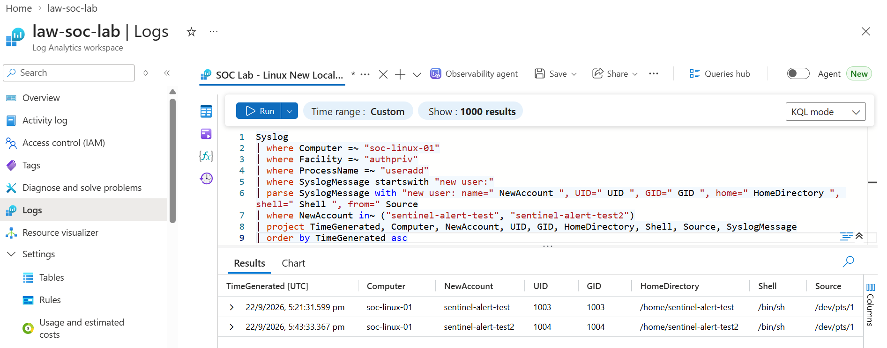
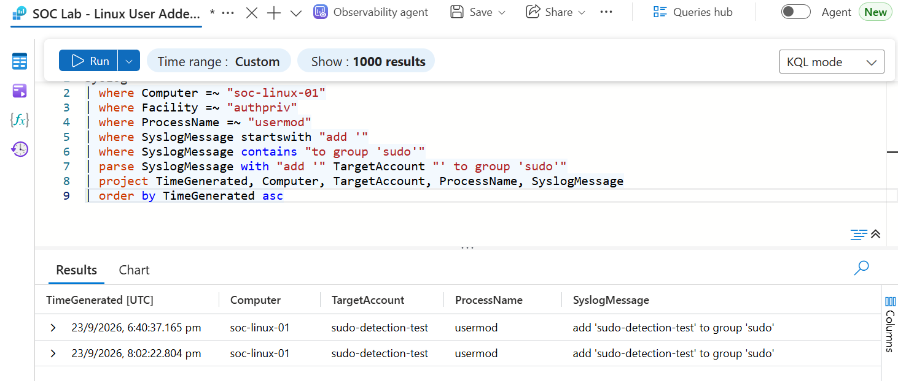
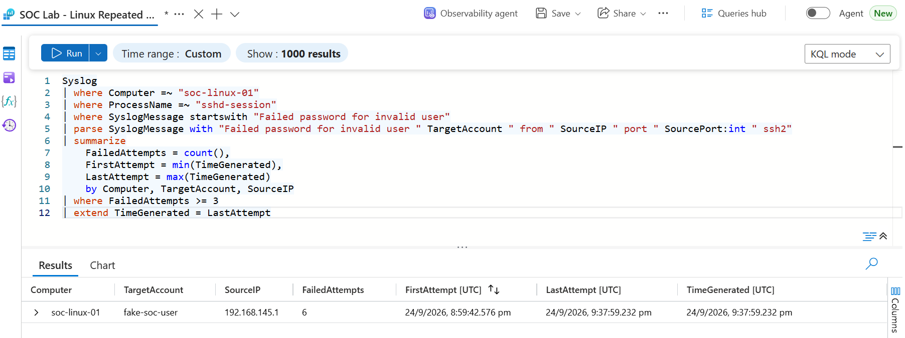
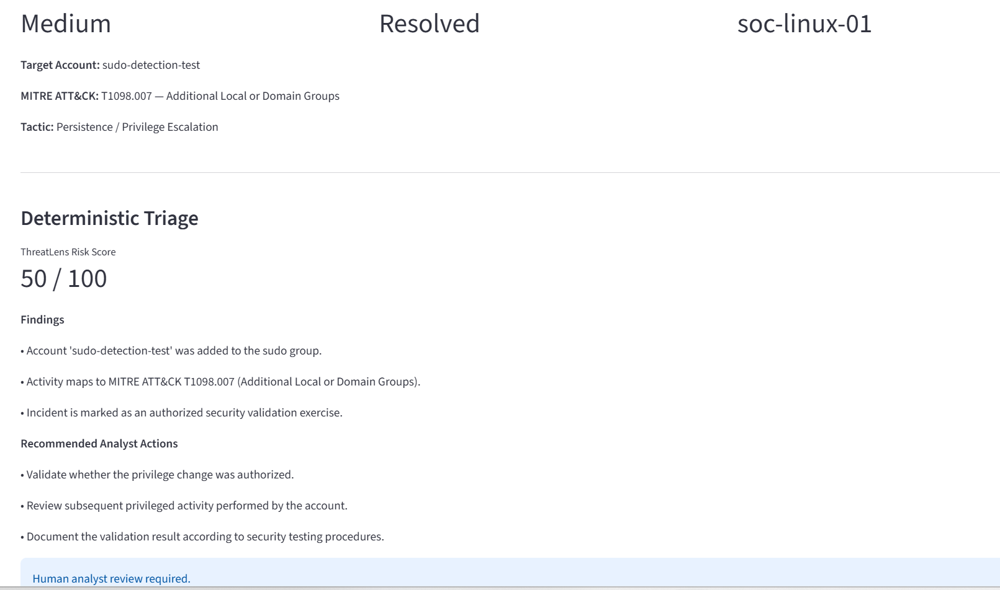
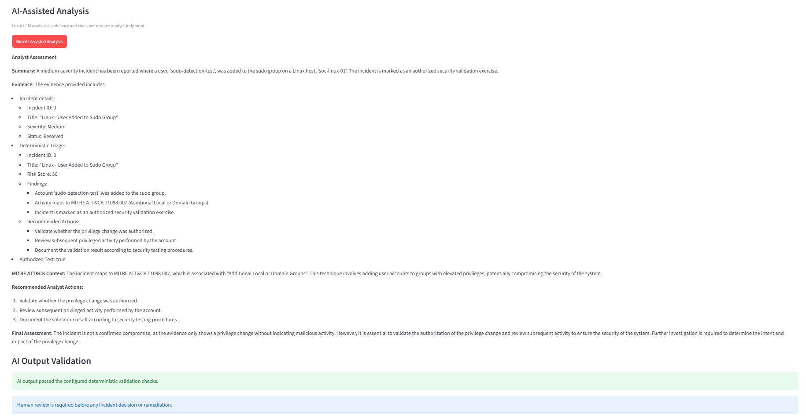
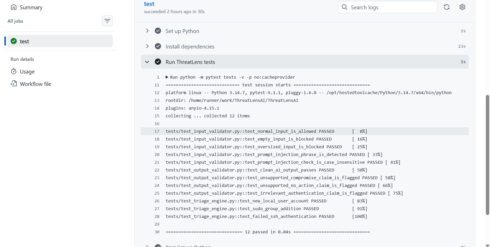

# 🛡️ ThreatLens AI


ThreatLens AI is an AI-assisted SOC incident triage project that combines Microsoft Sentinel detections, deterministic security analysis, MITRE ATT&CK context, local LLM analysis, deterministic AI-output validation, and mandatory human analyst review.

The project was built using a controlled Linux SOC lab connected to Microsoft Sentinel and demonstrates an end-to-end workflow from security telemetry and KQL detection through analyst-facing triage.

> **MVP boundary:** ThreatLens currently uses representative structured incident payloads derived from controlled Microsoft Sentinel lab incidents. Live Microsoft Sentinel API ingestion is not implemented in this version.

---

## 🎯 Project Goals

ThreatLens was designed to explore how AI can assist a SOC analyst without allowing an LLM to become the authoritative source for security decisions.

The workflow deliberately separates:

- Security telemetry and detection
- Deterministic incident triage
- MITRE ATT&CK context
- AI-assisted interpretation
- Deterministic AI-output validation
- Human analyst decision-making

The LLM does **not** determine the ThreatLens risk score, automatically close incidents, or perform remediation.

---

## 🏗️ Architecture

```text
VMware Ubuntu (soc-linux-01)
        |
        v
Azure Arc
        |
        v
Azure Monitor Agent (AMA)
        |
        v
Data Collection Rule (DCR)
        |
        v
Log Analytics Workspace
        |
        v
Microsoft Sentinel
        |
        v
KQL Analytics Rules
        |
        v
Sentinel Incidents
        |
        v
Representative Incident Payloads
        |
        v
ThreatLens FastAPI Backend
        |
        v
Deterministic Triage + MITRE ATT&CK Context
        |
        v
Local Ollama LLM (llama3.2:3b)
        |
        v
Deterministic AI Output Validator
        |
        v
Human Analyst Review
        |
        v
Streamlit SOC Dashboard
```

---

## 🔎 Microsoft Sentinel Detection Engineering

Three custom KQL detection scenarios were implemented and validated using controlled Linux activity.

### 1. New Local User Account Created

Detects successful Linux local-account creation events recorded by `useradd`.

**MITRE ATT&CK:** T1136.001 — Create Account: Local Account

```kusto
Syslog
| where Computer =~ "soc-linux-01"
| where Facility =~ "authpriv"
| where ProcessName =~ "useradd"
| where SyslogMessage startswith "new user:"
| parse SyslogMessage with "new user: name=" NewAccount ", UID=" UID ", GID=" GID ", home=" HomeDirectory ", shell=" Shell ", from=" Source
| project TimeGenerated, Computer, NewAccount, UID, GID, HomeDirectory, Shell, Source, SyslogMessage
```

Controlled validation generated accounts including `sentinel-alert-test` and `sentinel-alert-test2`.



---

### 2. User Added to Sudo Group

Detects Linux accounts added to the `sudo` group.

**MITRE ATT&CK:** T1098.007 — Additional Local or Domain Groups

```kusto
Syslog
| where Computer =~ "soc-linux-01"
| where Facility =~ "authpriv"
| where ProcessName =~ "usermod"
| where SyslogMessage startswith "add '"
| where SyslogMessage contains "to group 'sudo'"
| parse SyslogMessage with "add '" TargetAccount "' to group 'sudo'"
| project TimeGenerated, Computer, TargetAccount, ProcessName, SyslogMessage
```

The controlled test account `sudo-detection-test` generated matching `usermod` telemetry.



---

### 3. Repeated Failed SSH Authentication

Detects repeated failed SSH authentication attempts against an invalid Linux account.

**MITRE ATT&CK:** T1110.001 — Brute Force: Password Guessing

```kusto
Syslog
| where Computer =~ "soc-linux-01"
| where ProcessName =~ "sshd-session"
| where SyslogMessage startswith "Failed password for invalid user"
| parse SyslogMessage with "Failed password for invalid user " TargetAccount " from " SourceIP " port " SourcePort:int " ssh2"
| summarize
    FailedAttempts = count(),
    FirstAttempt = min(TimeGenerated),
    LastAttempt = max(TimeGenerated)
    by Computer, TargetAccount, SourceIP
| where FailedAttempts >= 3
| extend TimeGenerated = LastAttempt
```

Historical validation telemetry shows six matching events across the broader evidence-query window for `fake-soc-user` from `192.168.145.1`.

The representative ThreatLens incident payload preserves three attempts from the original detection window. These values represent different query windows rather than conflicting results.



---

## ⚙️ Deterministic Incident Triage

ThreatLens performs deterministic analysis before invoking the LLM.

The triage engine evaluates known incident fields and produces:

- A custom ThreatLens risk score
- Evidence-based findings
- MITRE ATT&CK context
- Recommended analyst actions
- Mandatory analyst-review status

Current validated scenarios produce:

| Incident | Scenario | ThreatLens Risk Score |
|---|---|---:|
| 1 | New Local User Account Created | 40 / 100 |
| 3 | User Added to Sudo Group | 50 / 100 |
| 4 | Repeated Failed SSH Authentication | 35 / 100 |

These scores are **custom deterministic lab heuristics**. They are not Microsoft Sentinel risk scores and are not presented as an industry-standard scoring system.

### Example — Sudo Group Addition

ThreatLens identifies the privilege change, maps it to T1098.007, generates investigation actions, and requires analyst review.



---

## 🤖 Local AI-Assisted Analysis

ThreatLens uses a locally running Ollama model:

```text
llama3.2:3b
```

The model receives the structured incident and deterministic triage result and produces an analyst-oriented assessment containing:

1. Summary
2. Evidence
3. MITRE ATT&CK context
4. Recommended analyst actions
5. Final assessment

The prompt explicitly instructs the model not to invent indicators, users, hosts, processes, remediation, or unsupported compromise conclusions.

AI output remains advisory.



---

## 🛡️ AI Output Validation

LLM output is passed through an additional deterministic validator before being presented as trusted analyst context.

The current validator checks for specific classes of unsupported statements, including:

- Unsupported conclusions that compromise did not occur
- Unsupported statements that no further action is required
- Authentication conclusions applied to incidents that do not contain authentication evidence

If a configured condition is detected, ThreatLens produces a warning and requires additional analyst review.

This validator is intentionally described as a **guardrail**, not a complete hallucination detector. It uses deterministic phrase/context checks and cannot guarantee that every unsupported LLM statement will be detected.

Human review remains mandatory regardless of whether validation passes.

---

## 👨‍💻 Human-in-the-Loop Design

ThreatLens intentionally prevents the LLM from becoming the final decision-maker.

The system follows:

```text
Security Evidence
      ↓
Deterministic Triage
      ↓
LLM Interpretation
      ↓
Deterministic Output Validation
      ↓
Human Analyst Review
```

ThreatLens does not automatically:

- Declare an environment uncompromised
- Close Sentinel incidents
- Block accounts or IP addresses
- Perform remediation
- Change incident severity in Sentinel

The analyst remains responsible for the final investigation decision.

---

## 🖥️ Streamlit SOC Dashboard

The Streamlit interface provides an analyst-facing view of the representative incident queue.

It displays:

- Incident metadata
- Severity and status
- Host and target account
- MITRE ATT&CK mapping
- Deterministic ThreatLens risk score
- Findings
- Recommended analyst actions
- Local AI-assisted analysis
- AI-output validation results
- Human-review requirement

---

## 🧪 Automated Testing

ThreatLens includes automated tests for the security-critical deterministic components.

The current test suite contains **12 tests** covering:

### Input Validator

- Normal input is allowed
- Empty input is blocked
- Oversized input is blocked
- Configured prompt-injection phrase is detected
- Prompt-injection check is case-insensitive

### AI Output Validator

- Clean AI output passes configured checks
- Unsupported compromise conclusion is flagged
- Unsupported no-action conclusion is flagged
- Irrelevant authentication conclusion is flagged

### Deterministic Triage Engine

- New local user account scenario
- Sudo-group addition scenario
- Repeated failed SSH authentication scenario

Local validation:

```powershell
python -m pytest tests -v -p no:cacheprovider
```

Current result:

```text
12 passed
```

---

## 🔄 GitHub Actions CI

Automated testing is integrated with GitHub Actions.

The CI workflow:

1. Checks out the repository
2. Sets up Python
3. Installs project dependencies
4. Installs development/test dependencies
5. Executes the complete ThreatLens test suite

The current GitHub Actions run successfully collected and passed all 12 tests.



This provides repeatable validation of the deterministic triage and guardrail logic whenever the workflow runs.

---

## 🔐 Input Validation

ThreatLens also contains a basic input-validation component for validating user-supplied text.

Current checks include:

- Empty input
- Maximum input length
- A configured set of common prompt-injection phrases
- Case-insensitive matching

This is a basic application-layer guardrail and is **not presented as comprehensive prompt-injection protection**.

The `/validate` functionality is separate from the core representative Sentinel incident triage path.

---

## 🧰 Technology Stack

| Area | Technology |
|---|---|
| Lab Environment | VMware Workstation, Ubuntu Linux |
| Azure Connectivity | Azure Arc |
| Telemetry Collection | Azure Monitor Agent |
| Routing | Data Collection Rule |
| Log Platform | Log Analytics Workspace |
| SIEM | Microsoft Sentinel |
| Detection Language | KQL |
| Threat Context | MITRE ATT&CK |
| Backend | Python, FastAPI |
| Local AI | Ollama, llama3.2:3b |
| Dashboard | Streamlit |
| Testing | pytest |
| CI | GitHub Actions |
| Version Control | Git, GitHub |

---

## 📁 Project Structure

```text
ThreatLensAI/
├── .github/
│   └── workflows/
│       └── ci.yml
├── backend/
│   ├── app/
│   │   ├── ai/
│   │   │   ├── ollama_service.py
│   │   │   └── output_validator.py
│   │   ├── Security/
│   │   │   └── input_validator.py
│   │   ├── triage/
│   │   │   └── triage_engine.py
│   │   └── main.py
│   └── data/
│       ├── sample_alerts.json
│       └── sentinel_incidents.json
├── docs/
│   ├── screenshots/
│   │   ├── 01-sentinel-account-creation-detection.png
│   │   ├── 02-sentinel-sudo-group-detection.png
│   │   ├── 03-sentinel-failed-ssh-detection.png
│   │   ├── 04-threatlens-deterministic-triage.png
│   │   ├── 05-threatlens-ai-analysis-passed.png
│   │   └── 06-github-actions-tests-passed.png
│   └── triage-validation.md
├── tests/
│   ├── test_input_validator.py
│   ├── test_output_validator.py
│   └── test_triage_engine.py
├── dashboard.py
├── requirements.txt
├── requirements-dev.txt
└── README.md
```

---

## 🚀 Running ThreatLens Locally

### 1. Create a virtual environment

```powershell
python -m venv venv
.\venv\Scripts\Activate.ps1
```

### 2. Install application dependencies

```powershell
pip install -r requirements.txt
```

For development/testing:

```powershell
pip install -r requirements-dev.txt
```

### 3. Start Ollama

ThreatLens expects the local model:

```text
llama3.2:3b
```

### 4. Start the FastAPI backend

```powershell
uvicorn backend.app.main:app --reload
```

API documentation:

```text
http://127.0.0.1:8000/docs
```

### 5. Start the Streamlit dashboard

In a second terminal:

```powershell
streamlit run dashboard.py
```

Dashboard:

```text
http://localhost:8501
```

---

## 📊 Representative Incident Dataset

The MVP currently uses:

```text
backend/data/sentinel_incidents.json
```

The dataset contains representative structured payloads derived from controlled Sentinel lab incidents.

This project does **not** claim that the current MVP retrieves these incidents through the live Microsoft Sentinel API.

---

## ⚠️ Current Limitations

ThreatLens is a lab/portfolio MVP, not a production SOC platform.

Current limitations include:

- No live Microsoft Sentinel API ingestion
- Representative incident JSON is used as the application data source
- Risk scoring is a custom deterministic lab heuristic
- AI-output validation uses configured phrase/context checks
- Input validation is basic and not comprehensive prompt-injection protection
- No automated remediation
- No automatic Sentinel incident closure
- No production authentication/authorization layer
- Local Ollama availability is required for AI-assisted analysis

These limitations are intentionally documented rather than hidden.

---

## 🔮 Future Improvements

Potential next steps include:

- Live Microsoft Sentinel API integration
- Broader incident-schema validation
- More robust evidence-grounding checks for LLM output
- Additional unit and API integration tests
- Authentication and authorization
- Structured analyst feedback
- Expanded detection coverage
- Containerized deployment

---

## 📚 Validation Documentation

Detailed deterministic and AI-validation observations are preserved in:

[`docs/triage-validation.md`](docs/triage-validation.md)

---

## ⚖️ Lab Scope

All security activity was generated in a controlled lab environment for defensive security testing and learning.

ThreatLens is designed as an analyst-assistance workflow. AI-generated content requires human review before any security decision or remediation.